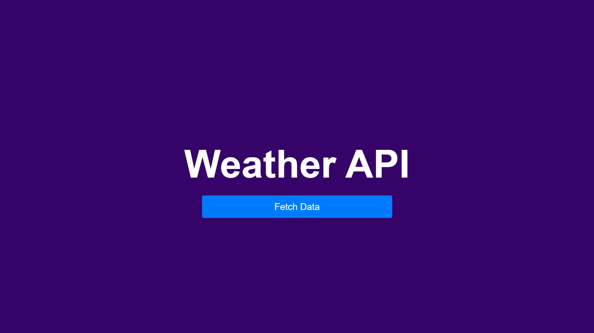

<div align="center">
  <h2 align="center">Weather-API - F2 Module Test</h2>

  A dynamic weather application that fetches current weather data for a user's location. The application will obtain the user's geolocation, display it on Google Maps, and then retrieve and display the relevant weather details from the OpenWeatherMap API.

  <a href="https://vishalp-08.github.io/Weather-API/"><strong>➥ Live Demo</strong></a>

</div>

<br />

### Demo Screeshots



### Prerequisites

Before you begin, ensure you have met the following requirements:

* [Git](https://git-scm.com/downloads "Download Git") must be installed on your operating system.

### Run Locally

To run **Recipe** locally, run this command on your git bash:

Linux and macOS:

```bash
sudo git clone https://github.com/vishalP-08/Weather-API.git
```

Windows:

```bash
git clone https://github.com/vishalP-08/Weather-API.git
```

### Contact

If you want to contact with me you can reach me at [WhatsApp](https://wa.me/917992199075).

